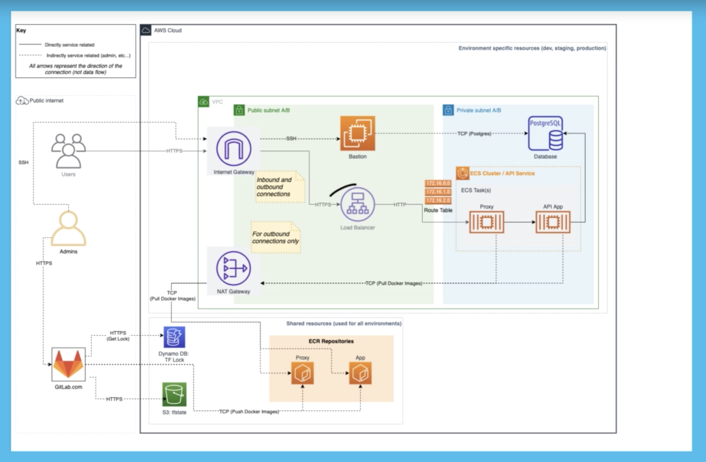

# User-service

User-service currently consists of 7 RPC. The Api/proto definations is present in api/proto/v1 if you update the proto defination don't forget to run the `make generate` 
Which will generate the required pb.go, grpc.pb.go and pb.gw.go files in the path /pkg/api/v1.

####Note:-
 The Project has GRPC-REST-Gateway implemented i.e all the RPC has their corresponding HTTP/REST enpoint.

## Steps to bootstrap the projcet
* Run `make db-bootstrap` to launch DB
* To start the server locally run `make build` followed by `make run`
* To deploy the service locally in  docker container run `make service-deploy`


* `./client.sh`: runs the client call for  the RPC that is not commented out  in cmd/client-grpc/main.go file

* The project also has a rest-client: cmd/client-rest

 * For login with google/facebook : `http://localhost:8457/v1/login/ui/`
  
  * For PgAdmin Setup [CLICK ME](https://medium.com/@sjnjaiswal/postgres-in-a-docker-container-simplified-b7e97ef30cfb)
  
  
## AWS Deployment Architecture 



* Note:-
   Terraform code resides in deploy folder at root of the project.


#AWS SETUP
Note:- Use this  region (US East (N. Virginia)us-east-1) 
* Login to you aws account using `Adminstrator IAM User` and  create a private s3 bucket (enable bucket versioning)
for storing terrafom state.(In use `user-service-aws-terraform-state-bucket`)

* Create a DynamoDB table (in use`user-service-aws-terraform-state-lock
` ) PrimaryKey=`LockID`  rest default. This table is to  put a lock on infastructure while it's in use. So that only one istance of terraform can be applied at any point in time.
  
* Create an AWS-ECR for storing images enable scan on push (in use `user-service-aws-terraform-registry` ) 


### Seting up aws-vault
* Install aws-vault
* create a admin user for aws
* run the command `aws-vault add user-name`
* Provide credential details
* update the ~/.aws/config with following content
 ```
[profile sajan.jaiswal]
region=us-east-1

// for MFA not required
mfa_serial=arn:aws:iam::259459167566:mfa/sajan.jaiswal
   ``` 
* Regenrate vault-credentials
`aws-vault exec sajan.jaiswal --duration=12h`


#### Terraform workspace
To Know more read the Terraform section of Makefile
## Bastion Instance
* An isnstance profile is something that we can assign to our bastion isnstance to give it IAM role information

* We are creating a bastion  instance with the ability to assume a role and then we will be creating IAM role that will allow it have access to our ecr repository


* Security Group allow you to to control the inbound and outbound access  allowed to that resource


 AWS bastion instance ssh key setup: 
* aws-console ->  ec2 dashboard -> network and security -> Key Pairs
* add you public ssh key there
* provide the key  pair name to `bastion_key_name` in variable.tf file


### Deploying the services on AWS-ECR
* Regenrate vault-credentials
`aws-vault exec sajan.jaiswal --duration=12h`
* Run `make tf-init`
* `make tf-fmt`
* `make tf-validate`
* `make tf-plan`
* `make tf-apply`


### For Bastion ssh access from local machine
`ssh ec2-user@ec2-54-224-151-134.compute-1.amazonaws.com`
### For copying backup.sql to bastion instance
`scp -r backup.sql ec2-user@ec2-54-162-139-196.compute-1.amazonaws.com:~/.`
### For Restoring backup.sql from bastion instance

 ``` docker run -v ~/:/var/pgdata -it --rm  jbergknoff/postgresql-client -huser-service-default-db.c7bjzqhwgcal.us-east-1.rds.amazonaws.com  -U recihgjhghpeapp userservice  -f /var/pgdata/backup.sql ```


##### DB Details
db_username = "recihgjhghpeapp"
db_password = "changeme67r6fvfy"
db_name     = "userservice"


## Docker AWS-ECR loging with aws-vault 
aws-vault exec sajan.jaiswal  aws ecr-public get-login-password --region us-east-1 | docker login --username AWS --password-stdin public.ecr.aws/f0x8s9w9


